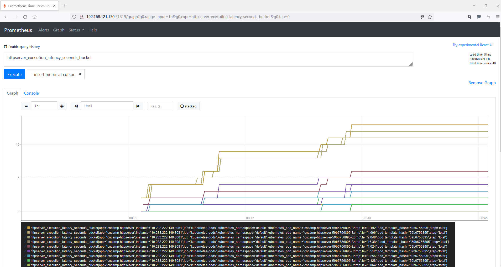
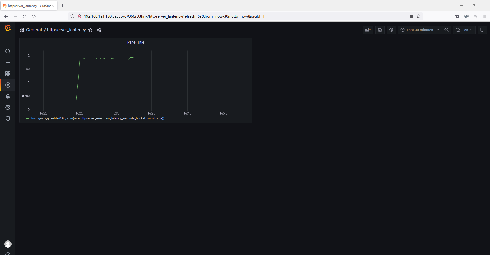

# 模块十

- 为 HTTPServer 添加 0-2 秒的随机延时
    [点击查看](https://github.com/hzhhong/cncamp/blob/main/module10/httpserver/main.go#L52-L67)

- 为 HTTPServer 项目添加延时 Metric
  - [register metrics](https://github.com/hzhhong/cncamp/blob/main/module10/httpserver/main.go#L80)
  - [add metrics handler](https://github.com/hzhhong/cncamp/blob/main/module10/httpserver/main.go#L119)

- 将 HTTPServer 部署至测试集群，并完成 Prometheus 配置

  1. 部署 `loki-stack`
    ```
    # download loki-stack
    helm pull grafana/loki-stack
    tar -xvf loki-stack-2.5.0.tgz

    cd loki-stack

    # fixed: no matches for kind "ClusterRole" in version "rbac.authorization.k8s.io/v1beta1"
    find . -name "*.yaml" -print0 | xargs -0 sed -i s#rbac.authorization.k8s.io/v1beta1#rbac.authorization.k8s.io/v1#g

    # add grafana repo
    helm repo add grafana https://grafana.github.io/helm-charts

    # install loki locally
    helm upgrade --install loki ./loki-stack --set grafana.enabled=true,prometheus.enabled=true,prometheus.alertmanager.persistentVolume.enabled=false,prometheus.server.persistentVolume.enabled=false
    ```
  2. 部署 `httpserver`
     1. [add prometheus annotations](https://github.com/hzhhong/cncamp/blob/main/module10/httpserver/httpserver.yaml#L16-L43)
     2. `kubectl apply -f httpserver.yaml`
   
- 从 Promethus 界面中查询延时指标数据
  
- （可选）创建一个 Grafana Dashboard 展现延时分配情况
  