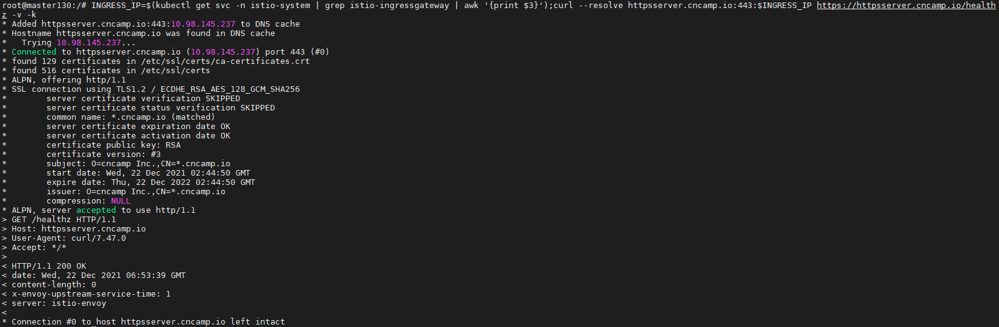
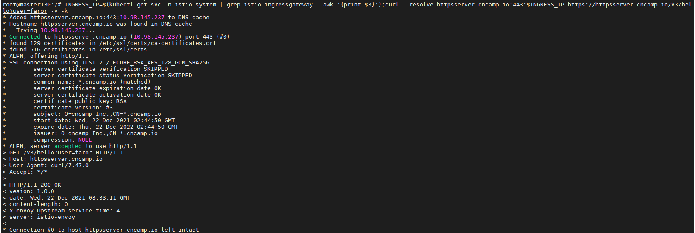
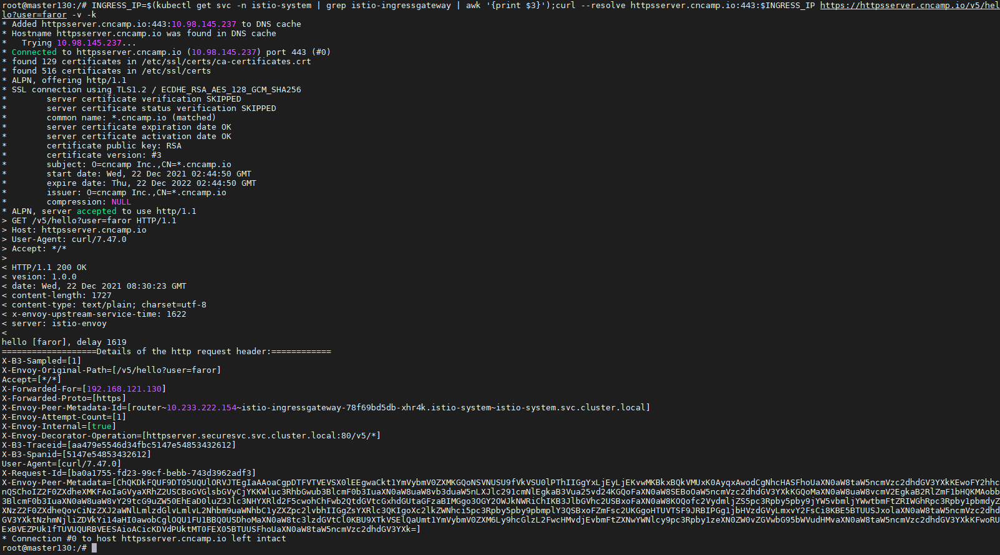
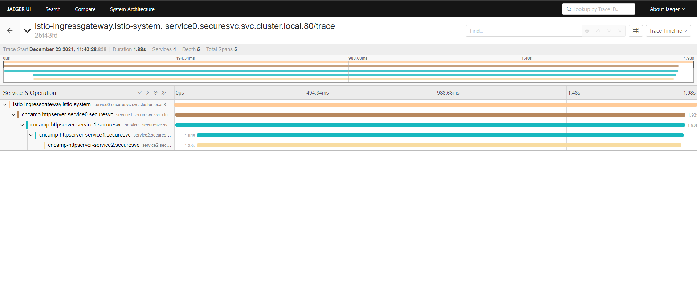

## deploy httpserver with tls
```
kubectl create ns securesvc
kubectl label ns securesvc istio-injection=enabled
kubectl create -f httpserver-v3.yaml -n securesvc
kubectl create -f httpserver-v5.yaml -n securesvc
```
```
openssl req -x509 -sha256 -nodes -days 365 -newkey rsa:2048 -subj '/O=cncamp Inc./CN=*.cncamp.io' -keyout cncamp.io.key -out cncamp.io.crt
# kubectl create -n istio-system secret tls cncamp-credential --key=cncamp.io.key --cert=cncamp.io.crt
kubectl apply -f cncamp-credential.yaml -n istio-system
kubectl apply -f istio-specs.yaml -n securesvc
```

## access the httpserver via ingress
```
INGRESS_IP=$(kubectl get svc -n istio-system | grep istio-ingressgateway | awk '{print $3}');curl --resolve httpsserver.cncamp.io:443:$INGRESS_IP https://httpsserver.cncamp.io/healthz -v -k
```



## canary

- v3
    ```
    INGRESS_IP=$(kubectl get svc -n istio-system | grep istio-ingressgateway | awk '{print $3}');curl --resolve httpsserver.cncamp.io:443:$INGRESS_IP https://httpsserver.cncamp.io/v3/hello?user=faror -v -k
    ```
    
   
- v5
    ```
    INGRESS_IP=$(kubectl get svc -n istio-system | grep istio-ingressgateway | awk '{print $3}');curl --resolve httpsserver.cncamp.io:443:$INGRESS_IP https://httpsserver.cncamp.io/v5/hello?user=faror -v -k
    ```
    

## tracing

### install
```
kubectl apply -f jaeger.yaml

# 设置百分百trace
kubectl edit configmap istio -n istio-system
set tracing.sampling=100
```
### deploy tracing
```
kubectl -n securesvc apply -f httpserver-v5-tracing-service0.yaml
kubectl -n securesvc apply -f httpserver-v5-tracing-service1.yaml
kubectl -n securesvc apply -f httpserver-v5-tracing-service2.yaml 
kubectl -n securesvc apply -f istio-specs.yaml
```
### access the tracing via ingress for 100 times(sampling rate is 1%)
```
INGRESS_IP=$(kubectl get svc -n istio-system | grep istio-ingressgateway | awk '{print $3}');curl --resolve httpsserver.cncamp.io:443:$INGRESS_IP https://httpsserver.cncamp.io/trace -v -k
```
### check tracing dashboard
```
istioctl dashboard jaeger --address 0.0.0.0
```
